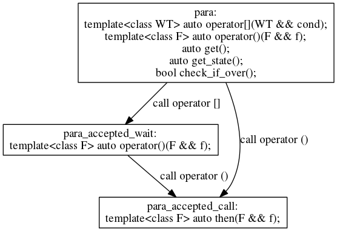

Function Flow实现
====================
本文适用于有兴趣了解FF内部细节的看官，同时，希望了解更多FF高级技术的看官也可以通过了解细节知道更多高级的技术。FF的实现有三个部分，API、运行时系统及并发工具集。其中API作为用户最直接的界面，关系到用户编程是否方便，是否容易犯错;运行时系统关系到FF的整体性能;并发工具集包括用于任务并发的数据结构，同步原语等。
#1. API实现
关于详细的API说明，可以参考Function Flow编程指南，此处仅说明一些实现中必要的细节。关于API的实现，FF尽最大努力保证能通过编译的程序是合法的，但是这在实际中是十分难以达成的。此处介绍FF在此方面的一些尝试。
##1.1 para<T>对象上的约束
我们希望para对象的使用有以下约束，这些约束对于提高FF的易用性是十分有帮助的。
	
	1. para对象只能用于一次函数的并行，即做为函数对象仅能调用一次重载后的（）;没有调用过（）的para对象称为*空para对象*，反之，称之为*非空para对象*;
	2. 仅当T为非void类型时，可以调用其get方法;
	3. 只有非空para对象可以调用then方法，且仅能调用一次then方法;
	4. 只有空para对象可以接受依赖表达式，且仅能接受一个依赖表达式。

在FF中，约束1通过在运行是抛出异常保证，即约束1是无法在编译阶段保证的。其余约束均在编译阶段保证，即用户无法写出违反上述约束的FF程序。FF引入类型变换的状态机保证上述约束，对para对象每次调用方法，都会引起返回类型的变化，如下图所示。

每次调用对应的操作之后，返回的类型是不同的，不同的类型所允许的操作也是不同的，这就保证了用户在调用某些操作之后无法调用另外的某些操作。例如用户无法在para对象上调用operator []之后再一次调用operator []，也无法在调用()之后再次调用operator []。

##1.2 依赖表达式的约束
依赖表达式仅能使用声明过的para对象及paragroup对象，虽然FF重载了&&及||操作，但是通过模板特化及enable_if机制保证了其仅能接受特定的类型，实现如下：

	template<class T>
	struct is_para_or_wait: public std::false_type{};

	template<class T>
	struct is_para_or_wait<para <T> > : public std::true_type{};

	template<class T1, class T2>
	struct is_para_or_wait<internal::wait_and<T1, T2> > : public std::true_type{};

	template<class T1, class T2>
	struct is_para_or_wait<internal::wait_or<T1, T2> > : public std::true_type{};

	template<>
	struct is_para_or_wait<internal::wait_all> : public std::true_type{};

	template<>
	struct is_para_or_wait<internal::wait_any> : public std::true_type{};

	template<class T1, class T2>
	auto operator &&(T1 && t1, T2 && t2)
	->typename std::enable_if< 
			is_para_or_wait<typename std::remove_reference<T1>::type>::value &&
			  is_para_or_wait<typename std::remove_reference<T2>::type>::value, 
                                  internal::wait_and<T1, T2> >::type;

	template<class T1, class T2>
	auto operator ||(T1 && t1, T2 && t2)
	->typename std::enable_if< 
			is_para_or_wait<typename std::remove_reference<T1>::type>::value &&
			  is_para_or_wait<typename std::remove_reference<T2>::type>::value,
			internal::wait_or<T1, T2> >::type;
因此仅正确的依赖表达式可以通过求解

#2. 运行时系统
##2.1 惰性初始化(Lazy initialization)
FF中的惰性初始化包括两个方面：1,FF在第一次使用时进行初始化，即不使用则无开销;2,依赖表达式使用类型树，且仅在判定时进行求值，因此不需要引入额外的运行时开销。
##2.2 线程池的结构
FF中的线程数目同核数相同（包括主线程），主线程在等待时同样参与工作负载的计算。
##2.3 递归并行
FF尚未引入栈保存机制以保证深度递归并行的高效性，未来需要实现。
##2.4 窃取调度
FF使用窃取调度机制保证系统的负载均衡，因此窃取调度队列的实现是系统性能的核心所在！FF中有基于锁实现的版本（稳定），也有基于无锁队列实现的版本（默认，高性能），未来仍然需要更好的窃取调度队列的实现。
#3. 并发工具集
未完成！